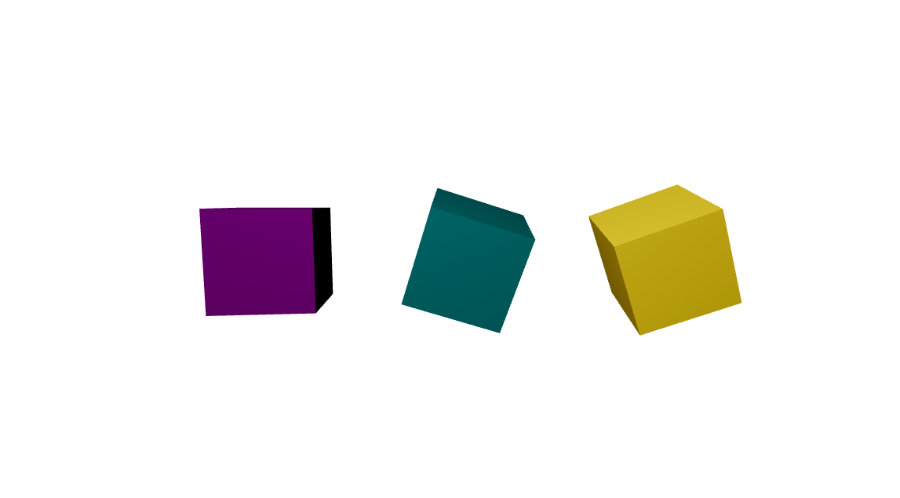

# React Three Fiber Hello Cube

This is the [hello cube example from threejs](https://threejs.org/manual/#en/fundamentals) written using
[react-three-fiber](https://github.com/pmndrs/react-three-fiber).

The tutorial results in 3 spinning cubes rendered in a scene with a light and camera.

It's built using [Create React App](https://create-react-app.dev/) and can be booted using `npm i && npm start`.